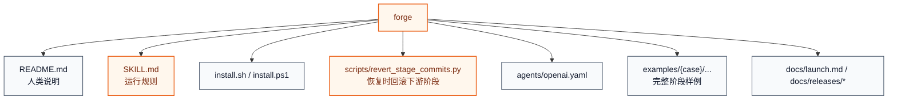
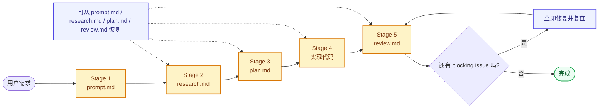
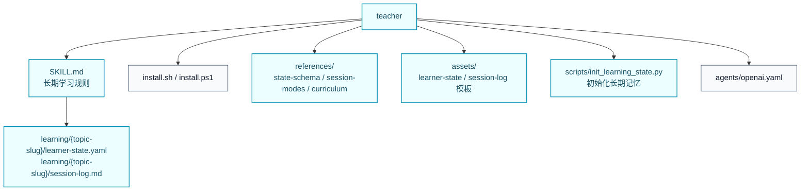

# Skill Foundry

Skill Foundry 是一个面向 Codex / Claude 的 skill 仓库，用来维护一组可安装、可复用、可独立演进的实用 skills。

这里的 skill 既可以是结构化开发工作流，也可以是长期学习工作流。根目录负责总览和安装入口；每个 skill 在自己的目录里维护文档、运行指令、安装器、脚本和参考资料。

## 仓库目标

- 维护高质量、可复用的 Codex / Claude skills
- 让每个 skill 都能独立安装、独立迭代、独立说明
- 提供统一的发现、安装和使用入口

## Skills

| 名字 | 简介 | 适用场景 | 触发方式 | 路径 |
| --- | --- | --- | --- | --- |
| `forge` | 显式触发的五阶段编码工作流 | 非 trivial 的开发、重构、修 bug、需要中间产物和 review 闭环的任务 | `$forge` / `/forge` | [`skills/forge`](skills/forge) |
| `teacher` | 有状态的长期学习 skill，支持围绕 GitHub repo 或知识领域持续学习 | 系统学习某个仓库、某个技术领域，跟踪当前进度、薄弱点、待学习目标 | `$teacher` / `/teacher` | [`skills/teacher`](skills/teacher) |

## Quick Start

### 发现所有 skill

```bash
./install.sh --list
```

```powershell
./install.ps1 -List
```

### 安装单个 skill

```bash
./install.sh forge
./install.sh teacher claude --scope project --project-dir /path/to/repo
```

```powershell
./install.ps1 -Skill forge
./install.ps1 -Skill teacher -Target claude -Scope project -ProjectDir C:\path\to\repo
```

### 安装全部 skill

```bash
./install.sh all
./install.sh all both --mode link
```

```powershell
./install.ps1 -Skill all -Target both
./install.ps1 -Skill all -Target both -Mode link
```

### 调用示例

```text
Codex  : $forge 帮我实现一个新的导出功能
Codex  : $teacher 帮我系统学习 vLLM 这个仓库，先梳理整体架构和 serving 路径
Claude : /teacher 帮我长期学习大模型推理，跟踪我当前进度和下一步目标
```

说明：

- 根目录安装器会自动扫描 `skills/*/install.sh` 或 `skills/*/install.ps1`
- 除第一个 `skill` 参数和第二个 `target` 参数外，其余参数会透传给具体 skill 的安装器
- `copy` 适合普通安装，`link` 适合本地开发和迭代 skill
- `claude --scope project` 会把 skill 安装到目标仓库下的 `.claude/skills/`

## Skills 详解

### `forge`

**简介**

`forge` 是一个显式触发的五阶段开发 skill，用来把模糊需求稳定推进成可 review、可恢复、可回滚的实现流程。

核心特征：

- 必须显式调用，不会因为“看起来像开发任务”而自动触发
- 中间产物固定为 `prompt.md`、`research.md`、`plan.md`、实现代码、`review.md`
- 每个阶段都有明确边界，并且对应 git stage commit
- 支持从指定阶段恢复，并在恢复前回滚失效的下游阶段提交

**架构图**



**流程图**



**用法**

安装：

```bash
./install.sh forge
./install.sh forge both --mode link
```

调用：

```text
Codex  : $forge 帮我实现一个新的导出功能
Codex  : $forge 请基于 research.md 继续，但只生成 plan.md
Claude : /forge Continue from plan.md and finish implementation plus review
```

更适合这类任务：

- 新功能开发
- 中等以上复杂度的 bug 修复
- 需要先研究再实现的重构
- 需要中间文档、明确审查和可恢复能力的工作

### `teacher`

**简介**

`teacher` 是一个有状态的长期学习 skill。它适合让 learner 围绕一个 GitHub repo、一个技术系统，或者一个知识领域持续学习，而不是每轮都从零开始。

它会把学习状态外置到文件，用长期记忆记录 learner 当前进度、已掌握内容、不稳固内容、待学习目标和下一步动作，并在每次会话里监督学习是否真正推进。

典型学习对象：

- 一个 GitHub repo，例如 `vLLM`、`SGLang`、`PyTorch`
- 一个技术领域，例如大模型推理、CUDA 性能优化、分布式训练
- 一个长期主题，例如面试准备、系统设计、源码阅读

核心特征：

- 学习状态保存在 `learning/{topic-slug}/`
- 每轮会话都会读取长期记忆，而不是只依赖聊天上下文
- 会跟踪 learner 当前进度、薄弱点、待学习目标和唯一下一步动作
- 模式明确区分 `map / teach / diagnose / drill / recall / plan`
- 默认内置 `LLM inference` 方向的课程图和模板

**架构图**



**流程图**


**用法**

安装：

```bash
./install.sh teacher
./install.sh teacher both --mode link
```

如需先初始化长期记忆：

```bash
python skills/teacher/scripts/init_learning_state.py --topic "LLM inference interview prep" --base-dir skills/teacher
```

调用：

```text
Codex  : $teacher 帮我系统学习 vLLM 这个仓库，先梳理整体架构和 serving 路径
Codex  : $teacher 帮我长期学习大模型推理，监督我现在的学习进度和待学习目标
Claude : /teacher 帮我继续上次的 LLM inference 学习，从 KV cache 开始
```

更适合这类任务：

- 系统学习一个 GitHub repo 或代码库
- 系统学习一个技术领域，例如大模型推理
- 需要长期记忆、学习进度监督和待学习目标管理的场景
- 需要多轮推进而不是单轮问答的学习任务

## 新增 Skill 的方式

1. 在 `skills/<name>/` 下创建独立目录。
2. 至少补齐 `README.md`、`SKILL.md`、`install.sh`。
3. 如果希望支持原生 PowerShell 安装，再补 `install.ps1`。
4. 把脚本、素材、示例、参考资料都收进该 skill 自己的目录。
5. 根目录安装器会自动发现可安装 skill，无需再改额外索引代码。

## License

Apache-2.0. See [`LICENSE`](LICENSE).
