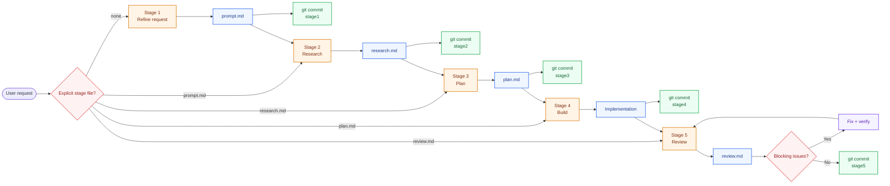

# 🔥 Forge

Turn a fuzzy request into shipped, reviewed code.

`prompt.md -> research.md -> plan.md -> build -> review.md`

Forge is a staged skill for **Codex** and **Claude**:

- Refine the task before touching code
- Keep every stage reviewable and revertable with git
- End with a blocking-issue review loop before calling it done

## 🏗️ Architecture



Quick read:

- Mention `prompt.md`, `research.md`, `plan.md`, or `review.md` explicitly to resume from that stage.
- If an upstream artifact changes, downstream stage commits are reverted before the flow continues.

## ⚡ Install

### macOS / Linux

```bash
./install.sh both
```

### Windows PowerShell

```powershell
./install.ps1 -Target both
```

Install only one tool if needed:

```bash
./install.sh codex
./install.sh claude
./install.sh claude --scope project --project-dir /path/to/repo
```

By default the installer copies the skill into:

- Codex: `${CODEX_HOME:-~/.codex}/skills/forge`
- Claude personal: `~/.claude/skills/forge`
- Claude project: `<repo>/.claude/skills/forge`

Use `--mode link` or `-Mode link` if you want a live symlink during development.

## ▶️ Use

Start a new session after installing.

```text
Codex  : $forge 帮我实现一个新的导出功能
Claude : /forge 帮我实现一个新的导出功能
```

## 🧭 Stages

| Stage | Trigger | Output |
| --- | --- | --- |
| 1 | no stage file mentioned | `prompt.md` |
| 2 | mention `prompt.md` | `research.md` |
| 3 | mention `research.md` | `plan.md` |
| 4 | mention `plan.md` | implementation |
| 5 | mention `review.md` | `review.md` + fix blocking issues |

Rules that matter:

- Mentioning the file name explicitly is how you resume.
- Stages 1-3 only write docs. No implementation before stage 4.
- Stage 5 loops inside one session until `review.md` says no blocking issues remain.
- Each stage ends with its own git commit.

## 🔁 Resume Examples

```text
$forge 帮我设计一个新的权限系统
$forge 请基于 prompt.md 继续
$forge 请基于 research.md 继续
$forge 请基于 plan.md 继续实现
$forge 请基于 review.md 继续 review
```

## 🧰 Included

- `SKILL.md` - the Forge workflow itself
- `scripts/revert_stage_commits.py` - revert downstream stage commits safely
- `agents/openai.yaml` - Codex skill metadata

## ✨ Why It Feels Good

- Clear before clever
- One stage at a time
- Easy to review
- Easy to revert
- Hard to skip thinking

## 📄 License

Apache-2.0
