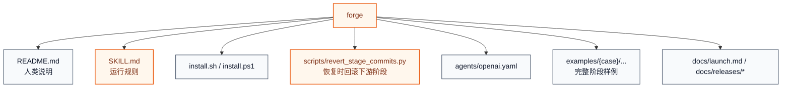
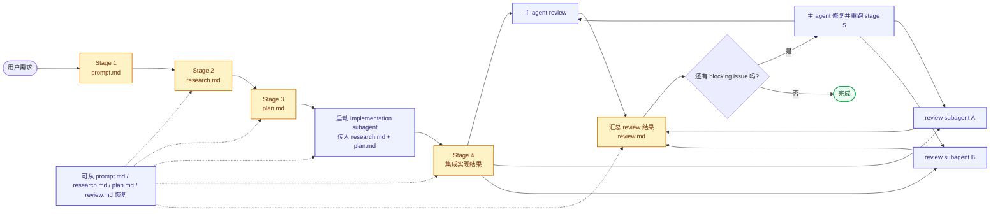
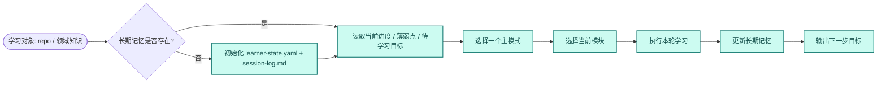

# Agent Skills

Agent Skills 是一个面向 Codex / Claude 的 skill 仓库，用来维护一组可安装、可复用、可独立演进的实用 skills。

这里的 skill 既可以是结构化开发工作流，也可以是长期学习工作流。根目录负责总览和安装入口；每个 skill 在自己的目录里维护文档、运行指令、安装器、脚本和参考资料。

## 仓库目标

- 维护高质量、可复用的 Codex / Claude skills
- 让每个 skill 都能独立安装、独立迭代、独立说明
- 提供统一的发现、安装和使用入口

## Skills

| 名字 | 简介 | 适用场景 | 触发方式 | 路径 |
| --- | --- | --- | --- | --- |
| `claude-codex-sync` | 在 Claude Code 与 Codex 之间同步指令文件、skills 和可映射配置 | 已在一侧维护了配置，希望导入另一侧，或希望对当前用户/当前仓库做双向对齐 | `$claude-codex-sync` / `/claude-codex-sync` | [`skills/claude-codex-sync`](skills/claude-codex-sync) |
| `forge` | 显式触发的五阶段编码工作流，stage4 用 implementation subagent，stage5 并行 review | 非 trivial 的开发、重构、修 bug、需要中间产物和 review 闭环的任务 | `$forge` / `/forge` | [`skills/forge`](skills/forge) |
| `mentor` | 有状态的长期学习 skill，支持围绕 GitHub repo 或知识领域持续学习 | 系统学习某个仓库、某个技术领域，跟踪当前进度、薄弱点、待学习目标 | `$mentor` / `/mentor` | [`skills/mentor`](skills/mentor) |

## Quick Start

### 发现所有 skill

- Bash: `./install.sh --list`
- PowerShell: `./install.ps1 -List`

### 安装单个 skill

- Bash: `./install.sh <skill>`
- PowerShell: `./install.ps1 -Skill <skill>`

### 安装全部 skill

- Bash: `./install.sh all`
- PowerShell: `./install.ps1 -Skill all`

### 常用变体

- Bash: `./install.sh mentor claude --scope project --project-dir /path/to/repo`
- Bash: `./install.sh all both --mode link`
- PowerShell: `./install.ps1 -Skill mentor -Target claude -Scope project -ProjectDir C:\path\to\repo`
- PowerShell: `./install.ps1 -Skill all -Target both -Mode link`

### 调用示例

```text
Codex  : $forge 帮我实现一个新的导出功能
Codex  : $mentor 帮我系统学习 vLLM 这个仓库，先梳理整体架构和 serving 路径
Claude : /mentor 帮我长期学习大模型推理，跟踪我当前进度和下一步目标
```

说明：

- 根目录安装器会自动扫描 `skills/*/install.sh` 或 `skills/*/install.ps1`
- 除第一个 `skill` 参数和第二个 `target` 参数外，其余参数会透传给具体 skill 的安装器
- `copy` 适合普通安装，`link` 适合本地开发和迭代 skill
- Codex 用户级 skill 会安装到 `~/.agents/skills/`，仓库级 skill 走 `<repo>/.agents/skills/`
- `claude --scope project` 会把 skill 安装到目标仓库下的 `.claude/skills/`

## 新增 Skill 文档要求

- 新加的 skill 必须在自己的 `README.md` 中提供完整架构图和流程图。
- 架构图需要覆盖入口、核心组件、主要文件/脚本和关键外部状态。
- 流程图需要覆盖主要命令路径，以及 diff / apply / 校验 / 输出这些关键阶段。

## Skills 详解

### `claude-codex-sync`

**简介**

`claude-codex-sync` 是一个用于 Claude Code 与 Codex 之间做 best-effort 同步的 skill。

它主要覆盖这些内容：

- `CLAUDE.md` 和 `AGENTS.md`
- 用户级与仓库级的 skills
- Codex 对 `CLAUDE.md` 的 project doc fallback 配置
- 不可直接映射的平台专有配置，会保存为 notes，避免静默丢失

核心特征：

- 默认建议先做 diff，再决定是否 `--apply`
- 支持 `Claude -> Codex` 和 `Codex -> Claude` 两个方向
- 支持 `user / repo / all` 三种 scope
- 会为 apply 生成备份目录，降低覆盖风险

**用法**

安装：

```bash
./install.sh claude-codex-sync
./install.sh claude-codex-sync both --mode link
```

常用命令：

```bash
python3 skills/claude-codex-sync/scripts/claude-codex-sync.py sync --from claude --to codex --scope all
python3 skills/claude-codex-sync/scripts/claude-codex-sync.py sync --from claude --to codex --scope all --apply
python3 skills/claude-codex-sync/scripts/claude-codex-sync.py sync --from codex --to claude --scope all
python3 skills/claude-codex-sync/scripts/claude-codex-sync.py status --scope all
python3 skills/claude-codex-sync/scripts/claude-codex-sync.py doctor --scope all
```

调用：

```text
Codex  : $claude-codex-sync 把当前仓库的 Claude 配置同步到 Codex，先做 diff
Codex  : $claude-codex-sync 检查当前用户级和仓库级的 Claude/Codex 配置状态
Claude : /claude-codex-sync Import Codex config into Claude for this repo, diff first
```

更适合这类任务：

- 已经长期使用 Claude Code，现在希望把约束、skills、说明文件迁到 Codex
- 已经长期使用 Codex，现在希望把项目指令和 skills 回填到 Claude
- 需要对当前用户环境和当前仓库做一次系统化同步
- 需要把不兼容项保留成 notes，避免迁移时静默丢失

### `forge`

**简介**

`forge` 是一个显式触发的五阶段开发 skill，用来把模糊需求稳定推进成可 review、可恢复、可回滚的实现流程。

核心特征：

- 必须显式调用，不会因为“看起来像开发任务”而自动触发
- 默认从用户需求一路自动执行到 stage 5，不需要中途显式干预
- `research.md` 和 `plan.md` 会交给一个 dedicated implementation subagent 完成 stage 4
- stage 5 由主 agent 和两个 review subagent 并行执行，最后由主 agent 汇总并决定是否修复后重跑
- 中间产物固定为 `prompt.md`、`research.md`、`plan.md`、实现代码、`review.md`
- 每个阶段都有明确边界，并且对应 git stage commit
- 支持从指定阶段恢复，并在恢复前回滚失效的下游阶段提交

**架构图**



**流程图**



**用法**

安装：

```bash
./install.sh forge
./install.sh forge both --mode link
```

调用：

```text
Codex  : $forge 帮我实现一个新的导出功能
Codex  : $forge 请基于 research.md 继续，但只生成 plan.md
Claude : /forge Continue from plan.md and finish implementation plus review
```

默认交互方式：

- 用户给出需求后，`forge` 会默认直接跑到 stage 5
- stage 4 由 implementation subagent 独立完成，stage 5 会自动拉起两个 review subagent 并行评审
- 用户通常只需要 review 最终结果，并决定是保留还是回滚
- 只有在想中途停下、指定 resume 点或只产出中间文档时，才需要显式加额外约束

更适合这类任务：

- 新功能开发
- 中等以上复杂度的 bug 修复
- 需要先研究再实现的重构
- 需要中间文档、明确审查和可恢复能力的工作

### `mentor`

**简介**

`mentor` 是一个有状态的长期学习 skill。它适合让 learner 围绕一个 GitHub repo、一个技术系统，或者一个知识领域持续学习，而不是每轮都从零开始。

它会把学习状态外置到文件，用长期记忆记录 learner 当前进度、已掌握内容、不稳固内容、待学习目标和下一步动作，并在每次会话里监督学习是否真正推进。

典型学习对象：

- 一个 GitHub repo，例如 `vLLM`、`SGLang`、`PyTorch`
- 一个技术领域，例如大模型推理、CUDA 性能优化、分布式训练
- 一个长期主题，例如面试准备、系统设计、源码阅读

核心特征：

- 学习状态保存在 `learning/{topic-slug}/`
- 每轮会话都会读取长期记忆，而不是只依赖聊天上下文
- 会跟踪 learner 当前进度、薄弱点、待学习目标和唯一下一步动作
- 模式明确区分 `map / teach / diagnose / drill / recall / plan`
- 默认内置 `LLM inference` 方向的课程图和模板

**架构图**


**流程图**



**用法**

安装：

```bash
./install.sh mentor
./install.sh mentor both --mode link
```

如需先初始化长期记忆：

```bash
python skills/mentor/scripts/init_learning_state.py --topic "LLM inference interview prep" --base-dir skills/mentor
```

调用：

```text
Codex  : $mentor 帮我系统学习 vLLM 这个仓库，先梳理整体架构和 serving 路径
Codex  : $mentor 帮我长期学习大模型推理，监督我现在的学习进度和待学习目标
Claude : /mentor 帮我继续上次的 LLM inference 学习，从 KV cache 开始
```

更适合这类任务：

- 系统学习一个 GitHub repo 或代码库
- 系统学习一个技术领域，例如大模型推理
- 需要长期记忆、学习进度监督和待学习目标管理的场景
- 需要多轮推进而不是单轮问答的学习任务

## 新增 Skill 的方式

1. 在 `skills/<name>/` 下创建独立目录。
2. 至少补齐 `README.md`、`SKILL.md`、`install.sh`。
3. 如果希望支持原生 PowerShell 安装，再补 `install.ps1`。
4. 把脚本、素材、示例、参考资料都收进该 skill 自己的目录。
5. 根目录安装器会自动发现可安装 skill，无需再改额外索引代码。
6. 新增 skill 时，先遵循仓库级规则文件 [AGENTS.md](AGENTS.md)。
7. 完成前运行 `python scripts/validate_skill_layout.py <name>`，确认新 skill 符合当前仓库规则。

## License

Apache-2.0. See [`LICENSE`](LICENSE).
