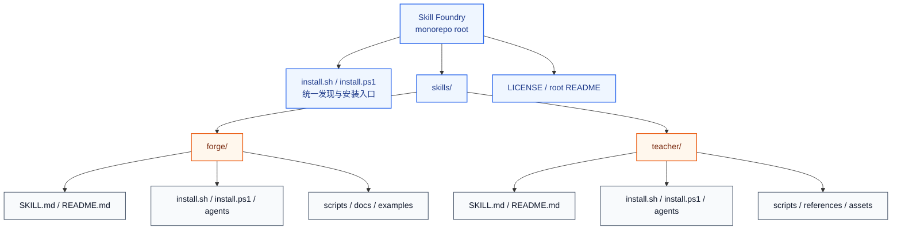
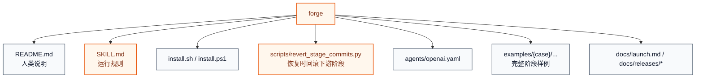
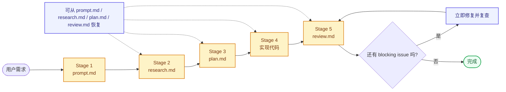

# Skill Foundry

Skill Foundry 是一个面向 Codex / Claude 的 skill monorepo。

这个仓库不再把单个 skill 平铺在根目录，而是统一收敛到 `skills/<name>/`。每个 skill 自带自己的 `README.md`、`SKILL.md`、安装脚本、脚本文件、素材、示例和参考资料；根目录只负责总览、发现和批量安装。

## 仓库目标

- 用一个仓库维护多个可独立安装的 skill
- 让每个 skill 保持自包含，便于单独演进和发布
- 让根目录保留统一入口：总览、安装、发现、贡献约定

## 当前 Skills

| 名字 | 简介 | 触发方式 | 适用场景 | 路径 |
| --- | --- | --- | --- | --- |
| `forge` | 显式触发的五阶段编码工作流 | `$forge` / `/forge` | 非 trivial 的开发、重构、修 bug、需要中间产物和 review 闭环的任务 | [`skills/forge`](skills/forge) |
| `teacher` | 有状态的教学与面试准备工作流 | `$teacher` / `/teacher` | 多轮学习、面试准备、诊断薄弱点、维护学习状态 | [`skills/teacher`](skills/teacher) |

## Monorepo 架构图



## 仓库流程图


## 快速开始

### 发现所有 skill

```bash
./install.sh --list
```

```powershell
./install.ps1 -List
```

### 安装单个 skill

```bash
./install.sh forge
./install.sh teacher claude --scope project --project-dir /path/to/repo
```

```powershell
./install.ps1 -Skill forge
./install.ps1 -Skill teacher -Target claude -Scope project -ProjectDir C:\path\to\repo
```

### 安装全部 skill

```bash
./install.sh all
./install.sh all both --mode link
```

```powershell
./install.ps1 -Skill all -Target both
./install.ps1 -Skill all -Target both -Mode link
```

说明：

- 根目录安装器会自动扫描 `skills/*/install.sh` 或 `skills/*/install.ps1`
- 除第一个 `skill` 参数和第二个 `target` 参数外，其余参数都会透传给具体 skill 的安装器
- `copy` 适合普通安装，`link` 适合本地开发和迭代 skill
- `claude --scope project` 会把 skill 安装到目标仓库下的 `.claude/skills/`

## 目录约定

```text
skills/
  <name>/
    README.md        # 面向人的说明文档
    SKILL.md         # 面向 agent 的运行指令
    install.sh       # Bash 安装器
    install.ps1      # PowerShell 安装器（可选但推荐）
    agents/          # Agent 元数据
    scripts/         # 辅助脚本
    assets/          # 模板、素材
    references/      # 参考资料 / schema / curriculum
    docs/            # 发布、宣传、额外说明
    examples/        # 可复用示例
```

## Skills 详解

### 1. `forge`

**简介**

`forge` 是一个显式触发的五阶段开发 skill，用来把模糊需求稳定推进成可 review、可恢复、可回滚的实现流程。

核心特征：

- 必须显式调用，不会因为“看起来像开发任务”而自动触发
- 中间产物固定为 `prompt.md`、`research.md`、`plan.md`、实现代码、`review.md`
- 每个阶段都有明确边界，并且对应 git stage commit
- 支持从指定阶段恢复，并在恢复前回滚失效的下游阶段提交

**架构图**



**流程图**



**用法**

安装：

```bash
./install.sh forge
./install.sh forge both --mode link
```

调用：

```text
Codex  : $forge 帮我实现一个新的导出功能
Codex  : $forge 请基于 research.md 继续，但只生成 plan.md
Claude : /forge Continue from plan.md and finish implementation plus review
```

更适合这类任务：

- 新功能开发
- 中等以上复杂度的 bug 修复
- 需要先研究再实现的重构
- 需要中间文档、明确审查和可恢复能力的工作

### 2. `teacher`

**简介**

`teacher` 是一个有状态的学习 skill。它把学习状态外置到文件，把主题组织成课程图，并且每次会话只选择一个主模式来推进学习。

核心特征：

- 学习状态保存在 `learning/{topic-slug}/`
- 每轮会话都会读状态、选模式、选模块、执行、写回状态
- 模式明确区分 `map / teach / diagnose / drill / recall / plan`
- 默认内置 `LLM inference interview prep` 的课程图和学习模板

**架构图**


**流程图**

```mermaid
flowchart LR
    goal([学习目标 / 面试目标]) --> check{learning/{topic-slug}<br/>是否存在?}
    check -->|否| init["初始化 learner-state.yaml + session-log.md"]
    check -->|是| load["读取 learner-state.yaml<br/>读取最近 session-log.md"]
    init --> load
    load --> mode["选择一个主模式"]
    mode --> module["选择当前模块"]
    module --> run["执行本轮讲解 / 诊断 / drill / recall / plan"]
    run --> update["更新状态与证据"]
    update --> next["输出唯一 next action"]

    classDef stage fill:#CCFBF1,stroke:#0F766E,color:#134E4A,stroke-width:1.5px;

    class init,load,mode,module,run,update,next stage;
```

**用法**

安装：

```bash
./install.sh teacher
./install.sh teacher both --mode link
```

如需先初始化学习状态：

```bash
python skills/teacher/scripts/init_learning_state.py --topic "LLM inference interview prep" --base-dir skills/teacher
```

调用：

```text
Codex  : $teacher 帮我开始准备 LLM inference 面试，先给我全景图
Codex  : $teacher 帮我诊断一下我对 KV cache 和 continuous batching 的真实水平
Claude : /teacher 帮我做一次 LLM serving mock interview drill
```

更适合这类任务：

- 需要跨多轮持续推进的学习目标
- 面试准备
- 知识诊断和薄弱点追踪
- 需要课程图、复习队列和明确下一步动作的场景

## 新增 Skill 的方式

1. 在 `skills/<name>/` 下创建独立目录。
2. 至少补齐 `README.md`、`SKILL.md`、`install.sh`。
3. 如果希望支持原生 PowerShell 安装，再补 `install.ps1`。
4. 把脚本、素材、示例、参考资料都收进该 skill 自己的目录。
5. 根目录安装器会自动发现可安装 skill，无需再改额外索引代码。

## License

Apache-2.0. See [`LICENSE`](LICENSE).
