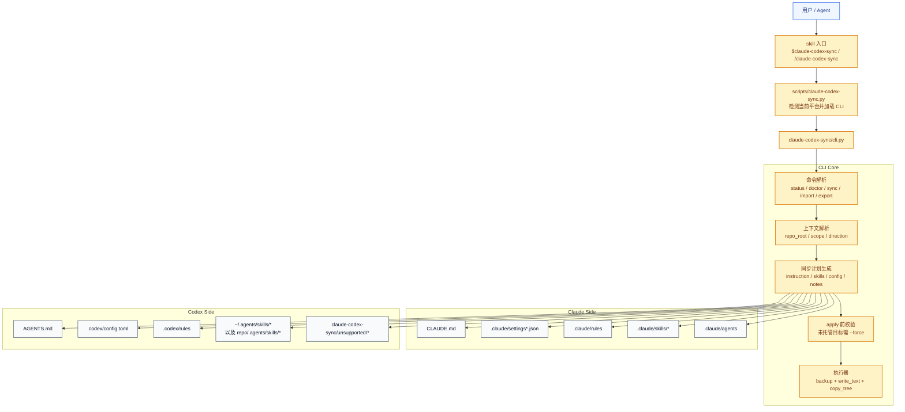
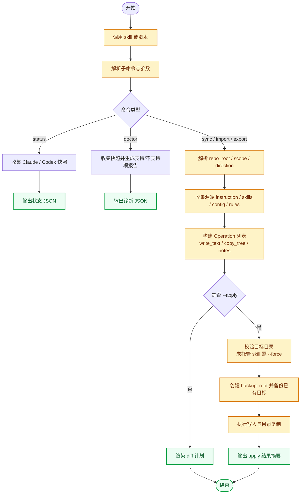

# claude-codex-sync

`claude-codex-sync` 是一个在 Claude Code 与 Codex 之间做 best-effort 配置同步的 skill。

它会尽量同步这些内容：

- `CLAUDE.md` 和 `AGENTS.md`
- 用户级与仓库级的 skills
- Codex 对 `CLAUDE.md` 的 project doc fallback 配置
- 无法直接映射的平台专有配置，会转成 notes 保留下来

## 架构图



## 流程图



## 安装

在本仓库根目录执行：

```bash
./install.sh claude-codex-sync
./install.sh claude-codex-sync both --mode link
```

如果只想安装到 Claude 或只安装到 Codex：

```bash
./install.sh claude-codex-sync claude --scope project --project-dir /path/to/repo
./install.sh claude-codex-sync codex
```

## 使用

推荐先看 diff，再决定是否 apply：

```bash
python3 skills/claude-codex-sync/scripts/claude-codex-sync.py sync --from claude --to codex --scope all
python3 skills/claude-codex-sync/scripts/claude-codex-sync.py sync --from claude --to codex --scope all --apply
```

其他常用命令：

```bash
python3 skills/claude-codex-sync/scripts/claude-codex-sync.py sync --from codex --to claude --scope all
python3 skills/claude-codex-sync/scripts/claude-codex-sync.py status --scope all
python3 skills/claude-codex-sync/scripts/claude-codex-sync.py doctor --scope all
```
