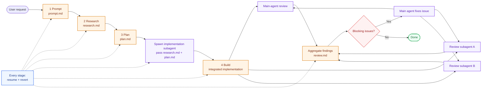

# Forge

Turn a fuzzy coding request into shipped, reviewed code.

`prompt.md -> research.md -> plan.md -> build -> review.md`

Forge is a staged skill for Codex and Claude. Invoke it explicitly with `$forge` or `/forge` when you want this workflow; it should not auto-trigger just because a task looks like a fit. It pushes a non-trivial coding task through a git-backed workflow that runs end to end by default while staying easy to review, resume, and revert.

In the default path, Forge starts from the user request and runs all the way through stage 5 automatically. Stage 4 is delegated to one implementation subagent, then stage 5 runs as a parallel review pass across the main agent plus two review subagents. The normal user job is to review the final result and decide whether to keep it or revert it, not to babysit each stage.

## Why Forge

| Common failure mode with AI coding | What Forge changes |
| --- | --- |
| The agent starts coding before the task is clear | Stage 1 rewrites the request into `prompt.md` before any implementation |
| Research disappears inside chat history | Stage 2 stores repository findings in `research.md` |
| Plans are vague or skipped | Stage 3 produces an implementation-ready `plan.md` |
| Build and review context get muddled together | Stage 4 is delegated to a dedicated implementation subagent, then stage 5 is rerun through independent review tracks |
| Rework is hard after requirements change | Each stage is resumable and downstream commits can be reverted safely |
| Review happens only if the user remembers to ask | Stage 5 forces a blocking-issue review loop before the task is done |

## Who It Is For

- Developers shipping non-trivial changes with Codex or Claude
- Teams that want reviewable artifacts before implementation
- Repositories where resumable artifacts and reviewable stage commits matter

## Not For

- One-line edits where a staged workflow would be overkill
- Repositories without git history
- Users who want the agent to freestyle instead of following an explicit process

## 30-Second Demo

1. Install the skill.
2. Start with a plain-language task.
3. Let Forge spawn the implementation subagent and run to stage 5 by default.
4. Resume by mentioning a stage file only when you need to restart from the middle.
5. Ask it to stop after a stage only when you want an intermediate checkpoint.

```text
Codex  : $forge Add CSV and JSON export for invoices
Codex  : $forge Continue from research.md
Codex  : $forge Continue from research.md but stop after plan.md
```

You end up with:

- `prompt.md`
- `research.md`
- `plan.md`
- implementation changes
- `review.md`
- one git commit per stage

In the common case, that is the whole interaction. You review the final output, then either keep it or revert it.

## Example Workflows

These examples make the workflow easy to share in docs, release notes, and social posts.

| Example | What it shows | Folder |
| --- | --- | --- |
| New export feature | A product-facing feature request that becomes an implementation plan | [`examples/new-export-feature`](examples/new-export-feature) |
| Auth refactor | A risky internal change that benefits from staged research and review | [`examples/auth-refactor`](examples/auth-refactor) |
| Webhook bugfix | A debugging task that still needs structure and a final review loop | [`examples/payment-webhook-bugfix`](examples/payment-webhook-bugfix) |

## Architecture



Quick read:

- No stage file mentioned means start at stage 1 and continue through `review.md` by default.
- The default experience is one request in, full stage-5 result out.
- Stage 4 is owned by one implementation subagent fed with `research.md` plus `plan.md`.
- Stage 5 is a parallel review pass across the main agent and two independent review subagents.
- Mention `prompt.md`, `research.md`, `plan.md`, or `review.md` to resume from that starting point.
- Ask to stop after a specific stage only when you want an intermediate checkpoint.
- Every stage supports revert before continuing.
- Stage 5 is the review-and-fix loop.

## Install

### macOS / Linux

```bash
./install.sh both
```

### Windows PowerShell

```powershell
./install.ps1 -Target both
```

Install only one tool if needed:

```bash
./install.sh codex
./install.sh claude
./install.sh claude --scope project --project-dir /path/to/repo
```

By default the installer copies the skill into:

- Codex: `${CODEX_HOME:-~/.codex}/skills/forge`
- Claude personal: `~/.claude/skills/forge`
- Claude project: `<repo>/.claude/skills/forge`

Use `--mode link` or `-Mode link` if you want a live symlink during development.

## Use

Start a new session after installing.

Forge is intended for explicit invocation only. Do not rely on the agent inferring Forge from the task shape alone.

Typical usage is simple: give Forge the task once, let it complete the implementation-subagent stage and the parallel review stage, then review the end state and decide whether to keep or revert it.

```text
Codex  : $forge 帮我实现一个新的导出功能
Claude : /forge 帮我实现一个新的导出功能
```

## Stages

| Stage | Trigger | Output |
| --- | --- | --- |
| 1 | no stage file mentioned | `prompt.md` |
| 2 | mention `prompt.md` | `research.md` |
| 3 | mention `research.md` | `plan.md` |
| 4 | mention `plan.md` | implementation via one dedicated implementation subagent |
| 5 | mention `review.md` | `review.md` plus fixes after main-agent and review-subagent aggregation |

These triggers select the starting stage. Forge continues into later stages by default unless the user explicitly asks it to stop early.

Rules that matter:

- Mentioning the file name explicitly selects the starting stage for resume.
- If you do not add another constraint, Forge continues from that starting stage through stage 5 in one invocation.
- If you start from a fresh request, Forge runs from stage 1 through stage 5 without needing explicit step-by-step confirmation.
- Stage 4 always delegates implementation to one dedicated implementation subagent that receives `research.md` and `plan.md`.
- Stage 5 always launches two review subagents, runs the main-agent review in parallel, and aggregates all findings before deciding whether to fix and loop.
- Ask to stop after `prompt.md`, `research.md`, `plan.md`, or implementation only when you want an intermediate pause.
- Stages 1-3 only write docs. No implementation before stage 4.
- Stage 5 loops inside one session until `review.md` says no blocking issues remain.
- Each stage ends with its own git commit.

## Resume Examples

```text
$forge 帮我设计一个新的权限系统
$forge 请基于 prompt.md 继续到结束
$forge 请基于 research.md 继续，但只生成 plan.md
$forge 请基于 plan.md 继续实现并 review 到完成
```

## Promotion Assets

- [`examples/`](examples) contains shareable case studies you can link in posts and release notes.
- [`docs/launch.md`](docs/launch.md) contains a launch checklist plus English and Chinese post copy.
- [`docs/releases/v0.1.0.md`](docs/releases/v0.1.0.md) contains a first release draft you can paste into GitHub Releases.

## Included

- `SKILL.md` - the Forge workflow itself
- `scripts/revert_stage_commits.py` - revert downstream stage commits safely
- `agents/openai.yaml` - Codex skill metadata

## License

Apache-2.0
