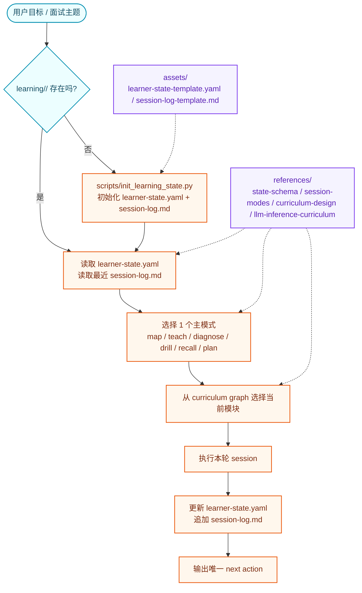

# Teacher

🧠 一个有状态的学习与面试准备 skill：它把学习进度写进文件、按课程图推进、每轮只跑一个教学模式，并在每次会话后给出明确的下一步。

## ✨ One-Liner

`teacher` 适合需要跨多轮持续学习的场景，尤其是 `LLM inference interview prep` 这类需要全景图、诊断、测验、复习和规划来回切换的主题。

## 🏗️ 架构流程



### 这套流程解决什么

- 📌 学习状态不丢：不依赖聊天记忆，状态都在 `learning/<topic-slug>/`
- 🗺️ 路径不散：不是平面 checklist，而是课程图谱
- 🎛️ 模式不单一：同一个 skill 支持概览、讲解、诊断、问答、复习、规划
- 🔁 每轮都闭环：每次 substantive session 都会写回证据、薄弱点和唯一下一步动作

## ⚡ Quick Start

### 1. 一键安装到 Codex + Claude

```bash
./install.sh
```

默认会安装到：

- Codex: `${CODEX_HOME:-~/.codex}/skills/teacher`
- Claude personal: `~/.claude/skills/teacher`

常用变体：

```bash
./install.sh codex
./install.sh claude
./install.sh claude --scope project --project-dir /path/to/repo
./install.sh both --mode link
```

### 2. 开始一个新主题

如果你还没有学习状态文件，可以先初始化：

```bash
python scripts/init_learning_state.py --topic "LLM inference interview prep"
```

如果主题名不是 ASCII，想让目录名更可读，可以自己指定 slug：

```bash
python scripts/init_learning_state.py \
  --topic "大模型推理面试准备" \
  --slug llm-inference-interview-prep-zh
```

### 3. 在 Codex / Claude 中使用

```text
Codex  : $teacher 帮我开始准备 LLM inference 面试，先给我全景图
Claude : /teacher 帮我诊断一下我对 KV cache 和 continuous batching 的真实水平
```

### 4. 第一次 session 会发生什么

1. 读取 `learning/<topic-slug>/learner-state.yaml`
2. 选择一个主模式，通常是 `map` 或 `diagnose`
3. 从课程图里选择当前模块，例如 `request-lifecycle`
4. 完成一轮讲解 / 诊断 / drill
5. 更新状态和日志
6. 给出一个唯一、可执行的 next action

## 📦 Skill 内容

- `SKILL.md`: 主工作流入口
- `references/`: 状态 schema、session mode、课程图设计、默认 LLM inference 课程图
- `assets/`: learner state 和 session log 模板
- `scripts/init_learning_state.py`: 初始化 `learning/<topic-slug>/`
- `agents/openai.yaml`: Codex skill 元数据

## 🎯 默认适配主题

当前默认内置最完整的是 `LLM inference interview prep`，覆盖：

- request lifecycle
- prefill / decode
- batching / scheduling
- KV cache
- kernels / hardware bottlenecks
- parallelism / distributed serving
- quantization
- decode optimizations
- serving architecture
- reliability / observability

## 🛠️ 开发者安装

如果你正在本地迭代这个 skill，推荐用软链接模式：

```bash
./install.sh both --mode link
```

这样改完当前目录文件后，Codex 和 Claude 都能直接看到最新版本。
